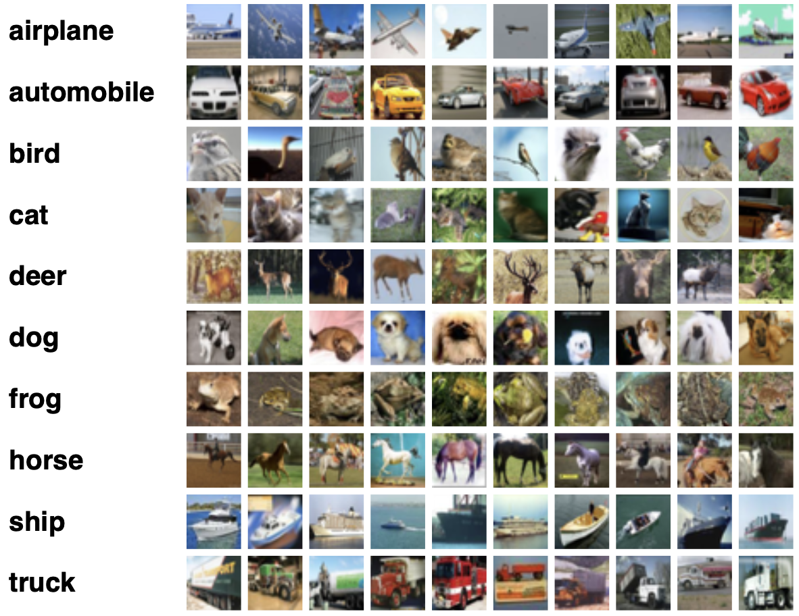

# Neural Networks

One of the applications of neural networks is classification. In this project, we are going to categorize images. We want to use different neural networks (specifically fully connected networks) to build a model that takes photos as input and predicts the classification of each photo.